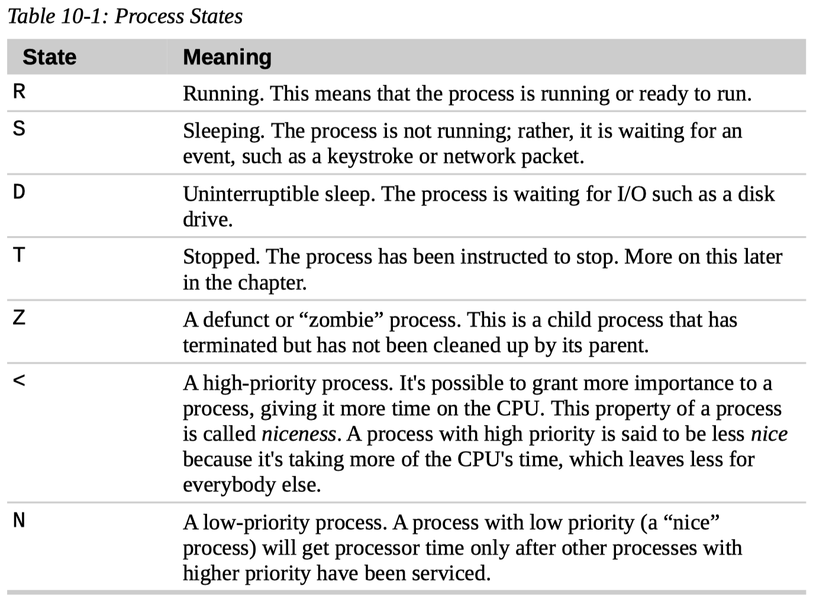

# 10. Processes

Processes are how Linux organizes the different programs waiting for their turn at the CPU.

## How a Process Works

- `init` and init scripts

  When a system starts up, the kernel initiates a few of **its own activities** as processes and launches a program called `init`.

  `init`, in turn, runs a series of shell scripts (located in `/etc`) called **init scripts**, which start all the system services.

- Daemon programs

  Many of these services are implemented as **daemon programs**, programs that just sit in the background and do their thing without having any user interface.

  So, even if we are not logged in, the system is at least a little busy performing routine stuff.

- A program launches other programs

  The fact that a program can launch other programs is expressed in the process scheme as a **parent process** producing a **child process**.

- Info about processes

  The kernel maintains information about each process to help keep things organized.

  For example, each process is assigned a number called a **process ID** (PID).

  PIDs are assigned in ascending order, with `init` always getting PID 1.

  The kernel also keeps track of the memory assigned to each process, as well as the processes' readiness to resume execution.

  Like **files**, processes also have **owners** and user IDs, effective user IDs, etc.

## Viewing Processes

### `ps`

- `$ ps`

  The `ps` program has a lot of options, but in its simplest form it is used like this:

  ``` console
  $ ps
      PID TTY          TIME CMD
   701110 pts/1    00:00:00 bash
   714880 pts/1    00:00:00 ps
  ```

  By default, `ps` doesn't show us very much, just the processes associated with the current terminal session.

  `TTY` is short for “teletype,” and refers to the **controlling terminal** for the process. Unix is showing its age here.

  The `TIME` field is the amount of CPU time consumed by the process. As we can see, neither process makes the computer work very hard.

- `$ ps x` sees every process we own

  Adding the “x” option (note that there is no leading dash) tells `ps` to show all of our processes regardless of what terminal (if any) they are controlled by.

  The presence of a “?” in the `TTY` column indicates no controlling terminal.

  Using this option, we see a list of every process that we **own**.

  A new column titled `STAT` has been added to the output. `STAT` is short for “state” and reveals the current status of the process, as shown in Table 10-1.

  

  The process state may be followed by other characters. These indicate various exotic process characteristics. See the `ps` man page for more detail.

- Style of `ps`

  Using the options without the leading dash invokes the command with “BSD style” behavior.

  The Linux version of `ps` can emulate the behavior of the `ps` program found in several different Unix implementations.

- `$ ps aux` sees processes every user owns

  Another popular set of options is “aux” (without a leading dash). This gives us even more information.

  This set of options displays the processes belonging to **every user**.

  With these options, we get the additional columns shown in Table 10-2.

  

### `top`

To see a more dynamic view of the machine's activity, we use the `top` command: `$ top`.

The `top` program displays a continuously updating (by default, every **three** seconds) display of the system processes listed in order of process activity.

The name **top** comes from the fact that the `top` program is used to see the “top” processes on the system.

The `top` display consists of two parts: a system summary at the top of the display, followed by a table of processes **sorted by CPU activity**.

The `top` program accepts a number of keyboard commands. The two most interesting are `h`, which displays the program's help screen, and `q`, which quits `top`.

## Controlling Processes

- `xlogo`

  `$ xlogo`

  After entering the command, a small window containing the logo should appear somewhere on the screen.

  We can verify that `xlogo` is running by resizing its window. If the logo is redrawn in the new size, the program is running.

  Notice how our shell prompt has not returned? This is because the shell is waiting for the program to finish, just like all the other programs we have used so far.

  If we close the `xlogo` window, the prompt returns.

### Interrupting a Process

First, enter the `xlogo` command and verify that the program is running.

Next, return to the terminal window and press `Ctrl-c`.

In a terminal, pressing `Ctrl-c`, **interrupts** a program. This means we are **politely** asking the program to terminate.

After we pressed `Ctrl-c`, the `xlogo` window closed and the shell prompt returned.

Many (but not all) command-line programs can be interrupted by using this technique.

### Putting a Process in the Background

Let's say we wanted to get the shell prompt back without terminating the `xlogo` program.

We can do this by placing the program in the **background**.

- Foreground and background of a terminal

  Think of the terminal as having a foreground (with stuff visible on the surface like the shell prompt) and a background (with stuff hidden behind the surface).

- Launch a program in the background

  To launch a program so that it is immediately placed in the background, we follow the command with an ampersand (&) character.

  ``` console
  $ xlogo &
  [1] 729043
  $
  ```

  After entering the command, the `xlogo` window appeared and the shell prompt returned, but some funny numbers were printed too.

- Job control

  This message is part of a shell feature called **job control**.

  With this message, the shell is telling us that we have started job number 1 (`[1]`) and that it has PID 28236.

  If we run `ps`, we can see our process.

- List jobs with `$ jobs`

  The shell's job control facility also gives us a way to list the jobs that have been launched from our terminal.

  Using the `jobs` command, we can see this list:

  ``` console
  $ jobs
  [1]+  Running                 xlogo &
  ```

  The results show that we have one job, numbered 1, that it is running, and that the command was `xlogo &`.

### Returning a Process to the Foreground

- Process in the background

  A process in the background is **immune** from terminal keyboard input, including any attempt to interrupt it with `Ctrl-c`.

- Move a background process to foreground with `fg`

  To return a process to the foreground, use the `fg` command in this way:

  ``` console
  $ jobs
  [1]+  Running                 xlogo &
  $ fg %1
  xlogo
  ```

- Jobspec

  The `fg` command followed by a percent sign and the job number (called a **jobspec**) does the trick.

  If we only have one background job, the jobspec is **optional**.

To terminate xlogo, press `Ctrl-c`.

### Stopping (Pausing) a Process

Sometimes we'll want to stop a process without terminating it.

This is often done to allow a foreground process to be moved to the background.

- `Ctrl-z` stops the process

  At the command prompt, type `xlogo`, press the `Enter` key, and then press `Ctrl-z`:

  ``` console
  $ xlogo
  ^Z
  [1]+  Stopped                 xlogo
  $
  ```

  After stopping `xlogo`, we can verify that the program has stopped by attempting to resize the `xlogo` window.

  We will see that it appears quite dead.

- We can continue the process in the foreground or background

  We can either continue the program's execution in the foreground, using the `fg` command, or resume the program's execution in the background with the `bg` command.

  As with the `fg` command, the jobspec is optional if there is only one job.

## Signals

Signals are one of several ways that the operating system communicates with programs.

We have already seen signals in action with the use of `Ctrl-c` and `Ctrl-z`. When the terminal receives one of these keystrokes, it sends a signal to the program in the **foreground**.

Programs, in turn, “listen” for signals and may act upon them as they are received.

### `kill`

The `kill` command is used to send signals to programs.

- Syntax

  Its most common syntax looks like this:

  `kill [-signal] PID...`

  We could have also specified the process using a jobspec (for example, `%1`) instead of a PID.

  Note that signals may be specified either by number or by name, including the name prefixed with the letters `SIG`.

  We may need to press the `Enter` key a couple of times before the message appears.

- Default signal

  If no signal is specified on the command line, then the `TERM` (terminate) signal is sent by default.

- Common signals

  The `kill` command is most often used to send the following signals:

  - 1 HUP SIGHUP hangup

  - 2 INT SIGINT interrupt

  - 9 KILL SIGKILL kill

  - 15 TERM SIGTERM terminate

  - 18 CONT SIGCONT continue

  - 19 STOP SIGSTOP stop

  - 20 TSTP SIGTSTP terminal stop

- Who can send signals to a process

  Processes, like files, have owners, and you must be the owner of a process (or the superuser) to send it signals with `kill`.

- Other common signals

  - 3 QUIT SIGQUIT quit
  - 11 SEGV SIGSEGV segmentation violation
  - 28 WINCH window change

- `$ kill -l`

  For the curious, a complete list of signals can be displayed with the following command.

### `killall`

It's also possible to send signals to multiple processes matching a specified program or username by using the `killall` command.

Here is the syntax:

`killall [-u user] [-signal] name...`

Remember, as with `kill`, we must have superuser privileges to send signals to processes that do not belong to us.

## Shutting Down the System

The process of shutting down the system involves the **orderly termination** of all the processes on the system, as well as performing some vital housekeeping chores (such as syncing all of the mounted file systems) before the system powers off.

There are four commands that can perform this function. They are `halt`, `poweroff`, `reboot`, and `shutdown`.

The first three are pretty self-explanatory and are generally used without any command line options.

### `shutdown`

The `shutdown` command is a bit more interesting.

With it, we can specify which of the actions to perform (halt, power down, or reboot) and provide a time delay to the shutdown event.

The delay can be specified in a variety of ways. See the `shutdown` man page for details.

Once the `shutdown` command is executed, a message is “broadcast” to all logged-in users warning them of the impending event.

## More Process-Related Commands

- `pstree`
- `vmstat`
- `xload`
- `tload`

## Summary

- Job control

  - List jobs

    `$ jobs`

  - Launch a program in the foreground

    When the terminal receives signal keystrokes, it sends a signal to the program in the **foreground**.

    Programs in the background is immune from any keystrokes.

  - Launch a program in the background

    Follow the command with an ampersand (&) character.

    After entering the command, the shell tells us about job number and PID of the process.

    A process in the background is **immune** from terminal keyboard input.

  - Move a background process to foreground

    `$ fg %1`

    `$ fg`

  - Move a foreground process to background

    First stop the process with `Ctrl-z`. The shell outputs the job number, `Stopped`, and command.

    This process is stopped, and does not run anymore.

    Then use `$ bg %1` or `$ bg` to move this process to background.

- Signal

  - Cannot be ignored

    - 9 KILL kill

      When a process is terminated in this manner, it is given no opportunity to “clean up” after itself or save its work. For this reason, the KILL signal should be used only as a last resort when other termination signals fail.

    - 19 STOP stop

      This signal causes a process to pause without terminating. Like the KILL signal, it is not sent to the target process, and thus it cannot be ignored.

  - Can be ignored

    - 1 HUP hangup

    - 2 INT interrupt

      This performs the same function as a `Ctrl-c` sent from the terminal. It will usually terminate a program.

    - 15 TERM terminate

      This is the default signal sent by the `kill` command. If a program is still “alive” enough to receive signals, it will terminate.

    - 18 CONT continue

      This will restore a process after a STOP or TSTP signal. This signal is sent by the `bg` and `fg` commands.

    - 20 TSTP terminal stop

      This is the signal sent by the terminal when `Ctrl-z` is pressed. Unlike the STOP signal, the TSTP signal is received by the program, but the program may choose to ignore it.
