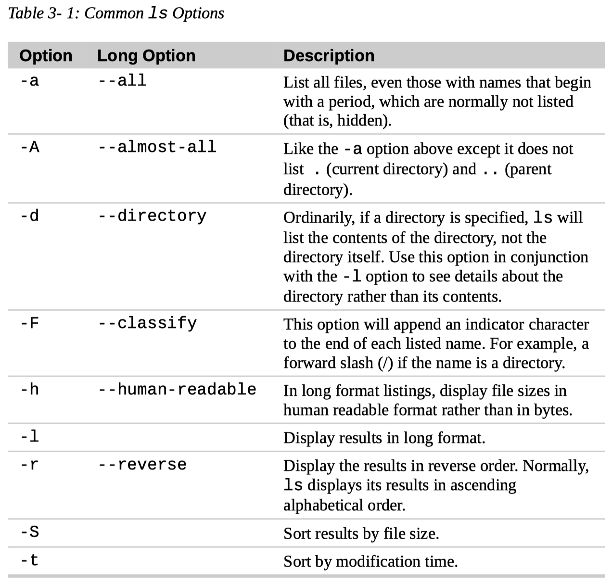
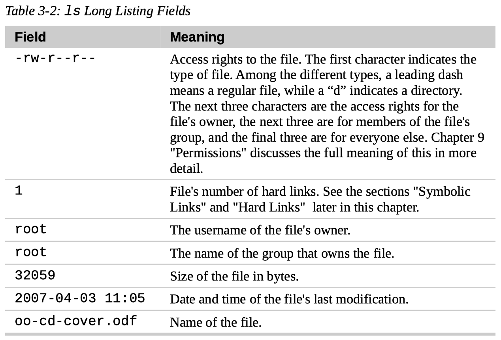
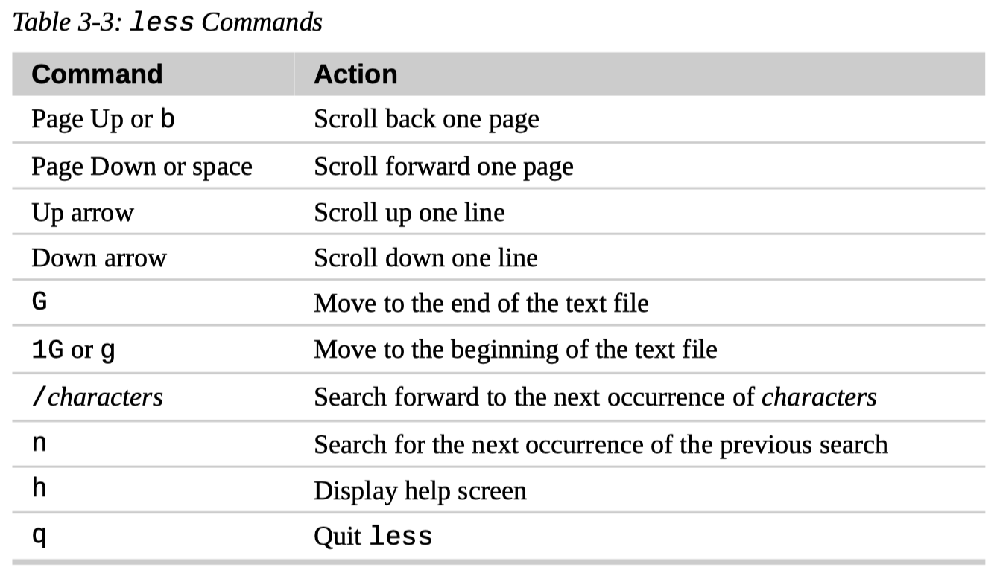

# 3. Exploring the System

## Having More Fun with `ls`

- `$ ls`

- `$ ls /usr`

- `$ ls ~ /usr`

  We can even specify multiple directories.

  In the following example, we list both the user's home directory (symbolized by the “~” character) and the `/usr` directory.

  ``` console
  $ ls ~ /usr
  /home/me:
  ...
  /usr:
  ...
  ```

### Options and Arguments

- How to invoke commands

  Commands are often followed by one or more **options** that modify their behavior, and further, by one or more **arguments**, the items upon which the command acts.

  So most commands look kind of like this:

  ```
  command -options arguments
  ```

- Short options and long options

  Most commands use options which consist of a single character preceded by a dash, for example, “-l”.

  Many commands, however, including those from the GNU Project, also support long options, consisting of a word preceded by two dashes.

  `$ ls -lt --reverse`

- Multiple short options strung together

  Also, many commands allow multiple short options to be strung together.

  `$ ls -lt`

- Options are case-sensitive

  Note that command options, like filenames in Linux, are case-sensitive.

### `ls` Options and Long Format

- Common `ls` options

  

- `ls` long listing fields

  

## Determing a File's Type with `file`

- `$ file filename`

- Everything is a file

  In fact, one of the common ideas in Unix-like operating systems such as Linux is that “everything is a file.”

## Viewing Text File with `less`

- Types of text files

  - Configuration files

    Because many of the files that contain system settings (called **configuration files**) are stored in this text format, and being able to read them gives us insight about how the system works.

  - Scripts

    Some of the actual **programs** that the system uses (called **scripts**) are stored in this text format.

- `$ less filename`

- `less` commands

  

- Less is more

  The `less` program was designed as an improved replacement of an earlier Unix program called `more`.

  The name “less” is a play on the phrase “less is more” — a motto of modernist architects and designers.

- Pagers

  `less` falls into the class of programs called “pagers,” programs that allow the easy viewing of long text documents in a page by page manner.

  Whereas the `more` program could only page forward, the `less` program allows paging both forward and backward and has many other features as well.

## Taking a Guided Tour

- Filesystem hierarchy standard

  The file system layout on a Linux system is much like that found on other Unix-like systems.

  The design is actually specified in a published standard called the **Filesystem Hierarchy Standard**.

  Not all Linux distributions conform to the standard exactly but most come pretty close.

- Reset terminal

  If we accidentally attempt to view a non-text file and it scrambles the terminal window, we can recover by entering the `reset` command.

## Symbolic Links

- Symbolic links are also known as soft links or sym-links

- Use of symbolic links
