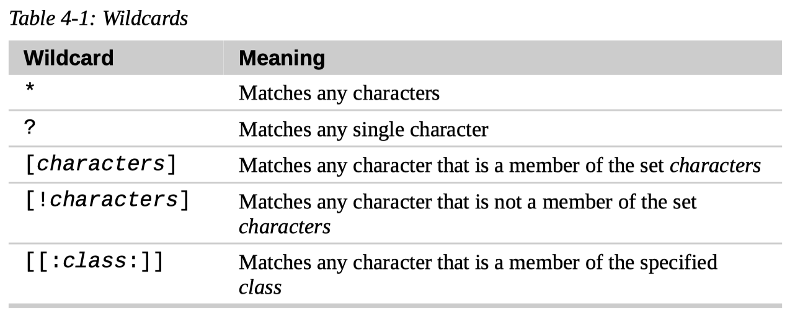
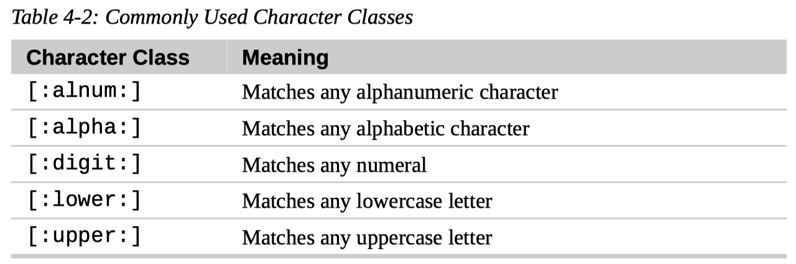
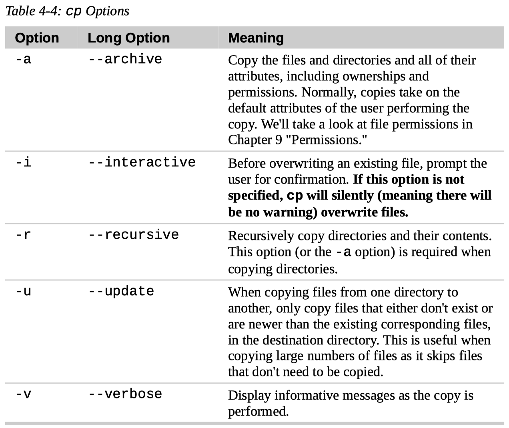
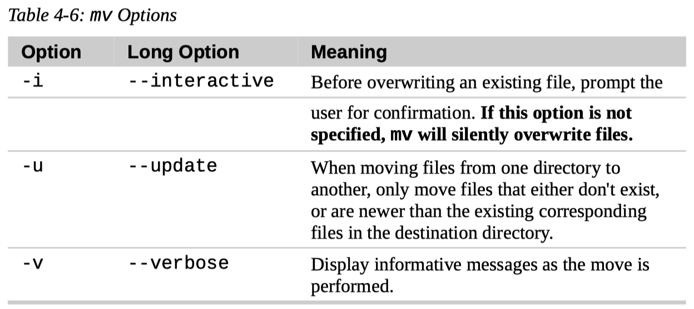
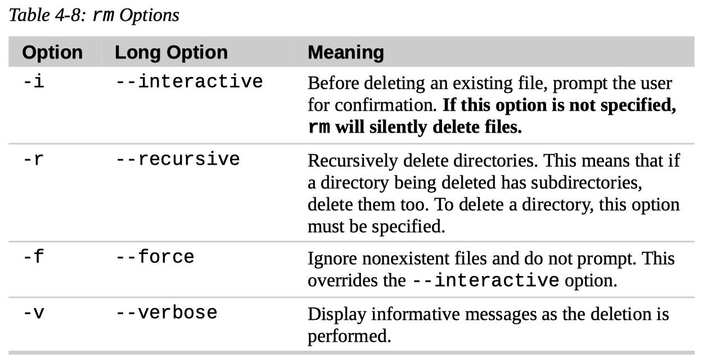

# 4. Manipulating Files and Directories

## Wildcards

- What is wildcards

  Since the shell uses filenames so much, it provides special characters to help us rapidly specify groups of filenames.

  These special characters are called **wildcards**.

  Using wildcards (which is also known as **globbing**) allows us to select filenames based on patterns of characters.

- List of wildcards

  

- Commonly used character classes

  

- Where can wildcards be used

  Wildcards can be used with any command that accepts filenames as arguments.

- Better not use character ranges

  If you are coming from another Unix-like environment or have been reading some other books on this subject, you may have encountered the `[A-Z]` and `[a-z]` character range notations.

  These are traditional Unix notations and worked in older versions of Linux as well.

  They can still work, but you have to be careful with them because they will not produce the expected results unless properly configured.

  For now, you should avoid using them and use character classes instead.

## `mkdir`

- `$ mkdir dir1`
- `$ mkdir dir1 dir2 dir3`

## `cp`

### Two Ways of Using `cp`

- `$ cp item1 item2`

  `item1` must exist.

  ---

  If `item2` exists, it is easy to tell whether `item2` is a file or a directory.

  - `item1` is a file, `item2` is a file

    `item2` is overwritten with the contents of `item1`.

  - `item1` is a file, `item2` is a directory

    A new `item1` is created in `item2`. Or, `item1` in `item2` is overwritten.

  - `item1` is a directory, `item2` is a directory

    The `-R`, `-a`, or `-r` options must be used.

    A new `item1` is created in `item2`. Or, `item1` in `item2` is merged with `item1`.

  ---

  If `item2` does not exist, we cannot tell whether `item2` is a file or a directory.

  - `item1` is a file, `item2` is a file

    If `item1` is a file, `cp` assumes `item2` is a file. If `item2` does not contain non-existing directories. it is created.

    `item1` is the same as `item2`.

  - `item1` is a directory, `item2` is a directory

    If `item1` is a directory, `cp` assumes `item2` is a directory. If `item2` does not contain non-existing directories. it is created.

    The contents of two directories are the same.

- `$ cp item... directory`

  `item`s that does not exist do not get copied, only existing `item`s get copied.

  `directory` must exist.

  If `item` is a file, a new `item` is created in `directory`. Or, `item` in `directory` is overwritten.

  If `item` is a directory, a new `item` is created in `directory`. Or, `item` in `directory` is merged with `item1`.

### `cp` Options

- Remember to use `-vi` options
- Use special options (`-R`, `-a`, `-r`) when dealing with directories
- When using the `-i` option, enter a `y` will confirm the operation, enter any other character (for example, `n`) will deny the operation

## `mv`

The `mv` command performs both file moving and file renaming, depending on how it is used.

In either case, the original filename no longer exists after the operation.

### Two Ways of Using `mv`

- `$ mv item1 item2`

  `item1` must exist.

  ---

  If `item2` exists, it is easy to tell whether `item2` is a file or a directory.

  - `item1` is a file, `item2` is a file

    (`item1` renamed to `item2`, original `item2` removed)

    `item2` is overwritten with the contents of `item1`.

    `item1` is removed.

  - `item1` is a file, `item2` is a directory

    (`item1` moved to `item2`)

    A new `item1` is created in `item2`. Or, `item1` in `item2` is overwritten.

    `item1` is removed.

  - `item1` is a directory, `item2` is a directory

    (`item1` moved to `item2`)

    The `-R`, `-a`, or `-r` options are not necessary.

    A new `item1` is created in `item2`. Or, `item1` in `item2` must be empty, then `item1` in `item2` is replaced with `item1`.

    `item1` is removed.

  ---

  If `item2` does not exist, we cannot tell whether `item2` is a file or a directory.

  - `item1` is a file, `item2` is a file

    (`item1` renamed to `item2`)

    If `item1` is a file, `mv` assumes `item2` is a file. If `item2` does not contain non-existing directories. it is created.

    `item1` is the same as `item2`.

    `item1` is removed.

  - `item1` is a directory, `item2` is a directory

    (`item1` renamed to `item2`)

    If `item1` is a directory, `mv` assumes `item2` is a directory. If `item2` does not contain non-existing directories. it is created.

    The contents of two directories are the same.

    `item1` is removed.

- `$ mv item... directory`

  (`item`s moved into `directory`)

  `item`s that does not exist do not get moved, only existing `item`s get moved.

  `directory` must exist.

  If `item` is a file, a new `item` is created in `directory`. Or, `item` in `directory` is overwritten.

  If `item` is a directory, a new `item` is created in `directory`. Or, `item` in `directory` must be empty, then `item` in `directory` is replaced with `item`.

  All `item`s are removed.

### `mv` Options

- Remember to use `-vi` options
- No need to use special options when dealing with directories
- When using the `-i` option, enter a `y` will confirm the operation, enter any other character (for example, `n`) will deny the operation

## `rm`

- `$ rm item...`

### `rm` Options

- Remember to use `-vi` options
- Use special options when dealing with directories
- When using the `-i` option, enter a `y` will confirm the operation, enter any other character (for example, `n`) will deny the operation

## `ln`

- Hard link

  `$ ln file-name link-name`

- Symbolic link

  `$ ln -s item-name link-name`

  `item-name` can be the name of a file or a directory.

### Hard Links

- Hard links are not modern

  Hard links are the original Unix way of creating links, compared to symbolic links, which are more modern.

- Every file has a hard link

  By default, every file has a single hard link that gives the file its name.

- Limitations

  Hard links have two important limitations:

  1.  Hard links cannot span physical devices.

      A hard link cannot reference a file outside its own **file system**. This means a link cannot reference a file that is not on the same **disk partition** as the link itself.

  2.  A hard link may not reference a directory.

- inode

  When thinking about hard links, it is helpful to imagine that files are made up of two parts.

  1.  The data part containing the file's contents.

  2.  The name part that holds the file's name.

  When we create hard links, we are actually creating additional name parts that all refer to the same data part.

  The system assigns a chain of disk blocks to what is called an inode, which is then associated with the name part.

  Each hard link therefore refers to a specific inode containing the file's contents.

- How to see inode info

  The `ls` command has a way to reveal this information. It is invoked with the `-i` option.

  `$ ls -li`

### Symbolic Links

- Overcome the limitations of hard links

  Symbolic links were created to overcome the limitations of hard links.

- How do symbolic links work

  Symbolic links work by creating a special type of file that contains a text pointer to the referenced file or directory.

- Sym-link and target

  A file pointed to by a symbolic link, and the symbolic link itself are largely indistinguishable from one another.

  For example, if we write something to the symbolic link, the referenced file is written to.

  However when we delete a symbolic link, only the link is deleted, not the file itself.

- Broken link

  If the file is deleted before the symbolic link, the link will continue to exist but will point to nothing. In this case, the link is said to be **broken**.

  In many implementations, the `ls` command will display broken links in a distinguishing color, such as red, to reveal their presence.

- `item-name` is relative to `link-name`

  Remember, when we create a symbolic link, we are creating a text description of where the target file is relative to the symbolic link.

- `item-name` can be a absolute pathname or a relative pathname

- Length of a sym-link file

  The length of a sym-link file is the number of characters in `item-name`.
