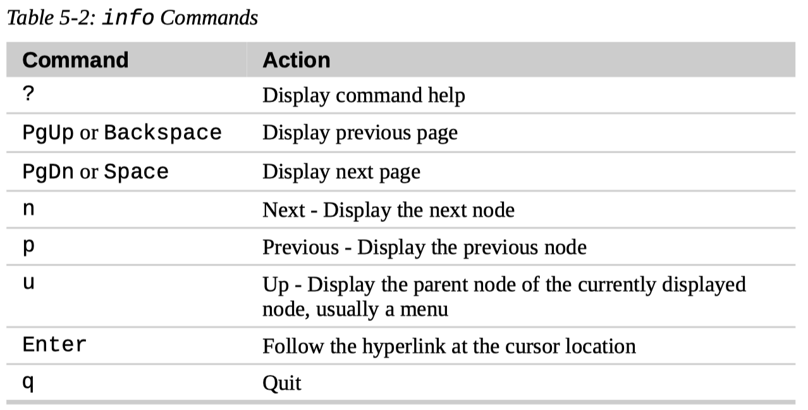

# 5. Working with Commands

## What Exactly Are Commands?

A command can be one of four different things:

1.  An executable program

    like all those files we saw in `/usr/bin`.

    Within this category, programs can be:

    - **compiled binaries** such as programs written in C and C++,
    - or programs written in **scripting languages** such as the shell, Perl, Python, Ruby, and so on.

2.  A command built into the shell itself.

    `bash` supports a number of commands internally called **shell builtins**.

    The `cd` command, for example, is a shell builtin.

3.  A shell function.

    Shell functions are miniature shell scripts incorporated into the **environment**.

    We will cover configuring the environment and writing shell functions in later chapters, but for now, just be aware that they exist.

4.  An alias.

    Aliases are commands that we can define ourselves, built from other commands.

## Identifying Commands

### `type`

The `type` command is a shell builtin that displays the kind of command the shell will execute, given a particular command name.

- `$ type command`
- `$ type -a command`

### `which`

To determine the exact location of a given **executable**, the `which` command is used.

`which` only works for executable programs, not builtins nor aliases that are substitutes for actual executable programs.

- `$ which ls`
- `$ which -a ls`

## Getting a Command's Documentation

### `help`

`bash` has a built-in help facility available for each of the shell builtins.

- `$ help cd`

  To use it, type “help” followed by the name of the shell builtin.

- `$ help`

  Display a list of help topics.

### `--help`

Many executable programs support a “--help” option that displays a description of the command's supported syntax and options.

Some programs don't support the “--help” option, but try it anyway. Often it results in an error message that will reveal the same usage information.

### `man`

Most executable programs intended for command line use provide a formal piece of documentation called a **manual** or **man page**.

A special **paging** program called `man` is used to view them.

On most Linux systems, man uses `less` to display the manual page, so all of the familiar `less` commands work while displaying the page.

- `$ man program`

- `$ man 5 passwd` or `$ man passwd.5` or `$ man 'passwd(5)'`

- `$ man -k partition` or `$ apropos partition`

  Search man pages whose names or short intros contain "partition".

- `$ man -f ls` or `$ whatis ls`

  Search man pages whose names are exactly "ls".

### `info`

- `$ info`
- `$ info coreutils`



### Other Program Documentation Files

- `/usr/share/doc`

  Many software packages installed on our system have documentation files residing in the `/usr/share/doc` directory.

  In `/usr/share/doc`, we will find documentation files organized by package.

  Most of these are stored in plain text format and can be viewed with `less`.

  Some of the files are in HTML format and can be viewed with a web browser.

- View `.gz` files with `zless`

  We may encounter some files ending with a “.gz” extension. This indicates that they have been compressed with the `gzip` compression program.

  The gzip package includes a special version of `less` called `zless` that will display the contents of gzip-compressed text files.

## Creating Our Own Commands with `alias`

- Command line trick

  It's possible to put more than one command on a line by separating each command with a semicolon.

  It works like this:

  ```
  command1; command2; command3...
  ```

- `$ alias foo='cd /usr; ls; cd-'`

  After the command `alias`, we give alias a name followed immediately (no whitespace allowed) by an equal sign, followed immediately by a quoted string containing the meaning to be assigned to the name.

  After we define our alias, we can use it anywhere the shell would expect a command.

- `$ unalias foo`

- `$ alias`

  To see all the aliases defined in the environment, use the `alias` command without arguments.

- Aliases vanish when session ends

  There is one tiny problem with defining aliases on the command line. They vanish when our shell session ends.

  In Chapter 11, "The Environment", we will see how to add our own aliases to the files that establish the environment each time we log on, but for now, enjoy the fact that we have taken our first, albeit tiny, step into the world of shell programming!
