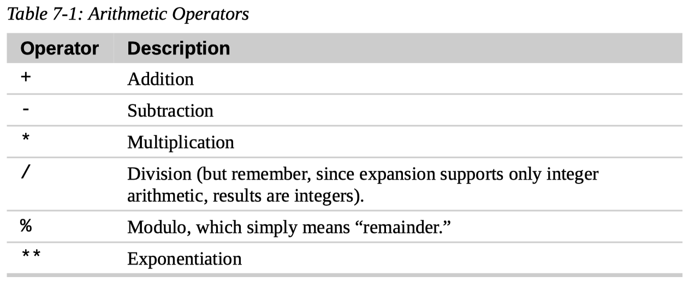

# 7. Seeing the World as the Shell Sees It

## Expansion

Each time we type a command and press the Enter key, `bash` performs several substitutions upon the text before it carries out our command.

We have seen a couple of cases of how a simple character sequence, for example `*`, can have a lot of meaning to the shell.

The process that makes this happen is called **expansion**.

With expansion, we enter something and it is expanded into something else before the shell acts upon it.

- `echo`

  To demonstrate what we mean by this, let's take a look at the `echo` command.

  `echo` is a shell builtin that performs a very simple task. It prints its text arguments on standard output.

  ``` console
  [me@linuxbox ～]$ echo this is a test
  this is a test
  ```

  That's pretty straightforward. Any argument passed to `echo` gets displayed.

- `$ echo *`

  ``` console
  [me@linuxbox ~]$ echo *
  Desktop Documents ls-output.txt Music Pictures Public Templates
  Videos
  ```

  So what just happened? Why didn't `echo` print `*`?

  The simple answer is that the shell expands the `*` into something else (in this instance, the names of the files in the current working directory) before the `echo` command is executed.

  When the Enter key is pressed, the shell automatically expands any qualifying characters on the command line before the command is carried out, so the `echo` command never saw the `*`, only its expanded result.

### Pathname Expansion

The mechanism by which wildcards work is called **pathname expansion**.

If we try some of the techniques that we employed in earlier chapters, we will see that they are really expansions.

### Pathname Expansion of Hidden Files

- `*` does not expand to hidden files

  As we know, filenames that begin with a period character are **hidden**.

  Pathname expansion also respects this behavior. An expansion such as the following does not reveal hidden files.

  `$ echo *`

- `.*` expands to hidden files, `.`, and `..`

  It might appear at first glance that we could include hidden files in an expansion by starting the pattern with a leading period, like this:

  `$ echo .*`

  It almost works. However, if we examine the results closely, we will see that the names `.` and `..` will also appear in the results.

  Because these names refer to the current working directory and its parent directory, using this pattern will likely produce an incorrect result.

  We can see this if we try the following command:

  `$ ls -d .* | less`

- `.[!.]*` seems better, but still flawed

  To better perform pathname expansion in this situation, we have to employ a more specific pattern.

  `$ echo .[!.]*`

  This pattern expands into every filename that begins with only one period followed by any other characters.

  This will work correctly with most hidden files (though it still won't include filenames with multiple leading periods).

- `$ ls -A` is the best

  The `ls` command with the `-A` option (“almost all”) will provide a correct listing of hidden files.

  `$ ls -A`

### Tilde Expansion

As we may recall from our introduction to the `cd` command, the tilde character (`~`) has a special meaning.

When used at the beginning of a word, it expands into the name of the home directory of the named user or, if no user is named, the home directory of the current user.

### Arithmetic Expansion

The shell allows arithmetic to be performed by expansion. This allows us to use the shell prompt as a calculator.

- Form

  Arithmetic expansion uses the following form:

  `$((expression))`

  where expression is an arithmetic expression consisting of values and arithmetic operators.

- Example

  ``` console
  [me@linuxbox ~]$ echo $((2 + 2))
  4
  ```

- Arithmetic expansion only supports integers

  Arithmetic expansion supports only integers (whole numbers, no decimals) but can perform quite a number of different operations.

- Arithmetic operators

  

- Expressions may be nested

  Spaces are not significant in arithmetic expressions and expressions may be nested.

  ``` console
  [me@linuxbox ~]$ echo $(($((5**2)) * 3))
  75
  ```

- Single parentheses may be used to group subexpressions

  Single parentheses may be used to group multiple subexpressions.

  With this technique, we can rewrite the previous example and get the same result using a **single expansion** instead of two.

  ``` console
  [me@linuxbox ~]$ echo $(((5**2) * 3))
  75
  ```

### Brace Expansion

- Pattern

  - Preamble

  - Brace expression

    The brace expression itself may contain either a comma-separated list of strings or a range of integers or single characters.

    The pattern may **not** contain unquoted whitespace.

    In bash version 4.0 and newer, integers may also be zero-padded.

  - Postscript

### Parameter Expansion

- Variables

  Many of its capabilities have to do with the system's ability to store small chunks of data and to give each chunk a name.

  Many such chunks, more properly called **variables**, are available for our examination.

- Examine a variable

  For example, the variable named `USER` contains our username.

  To invoke parameter expansion and reveal the contents of `USER` we would do this:

  ``` console
  [me@linuxbox ~]$ echo $USER
  me
  ```

- List all available variables

  `$ printenv | less`

- If pattern is mistyped

  You may have noticed that with other types of expansion, if we mistype a pattern, the expansion will not take place, and the `echo` command will simply display the mistyped pattern.

  With parameter expansion, if we misspell the name of a variable, the expansion will still take place but will result in an **empty** string:

  ``` console
  [me@linuxbox ~]$ echo $SUER

  [me@linuxbox ~]$
  ```

### Command Substitution

- `$ ls -l $(which cp)`

- `$ file $(ls -d /usr/bin/* | grep zip)`

  We are not limited to just simple commands. Entire pipelines can be used.

- `` $ ls -l `which cp` ``

  There is an alternate syntax for command substitution in older shell programs that is also supported in `bash`.

  It uses **backquotes** instead of the dollar sign and parentheses.

### Word-Splitting

## Quoting

The shell provides a mechanism called **quoting** to selectively suppress unwanted expansions.

### Double Quotes

If we place text inside double quotes, all the special characters used by the shell lose their special meaning and are treated as ordinary characters.

The exceptions are `$`, `\` (backslash), and `` ` `` (back-quote).

- Suppressed expansion

  This means that:

  - word-splitting,
  - pathname expansion,
  - tilde expansion,
  - and brace expansion

  are **suppressed**,

- Not suppressed expansion

  but

  - parameter expansion,
  - arithmetic expansion,
  - and command substitution

  are still carried out.

- Word-splitting

  By default, word-splitting looks for the presence of spaces, tabs, and newlines (linefeed characters) and treats them as **delimiters** between words.

  This means unquoted spaces, tabs, and newlines are not considered to be part of the text. They serve only as separators.

### Single Quotes

### Escaping Characters

- `sleep`
