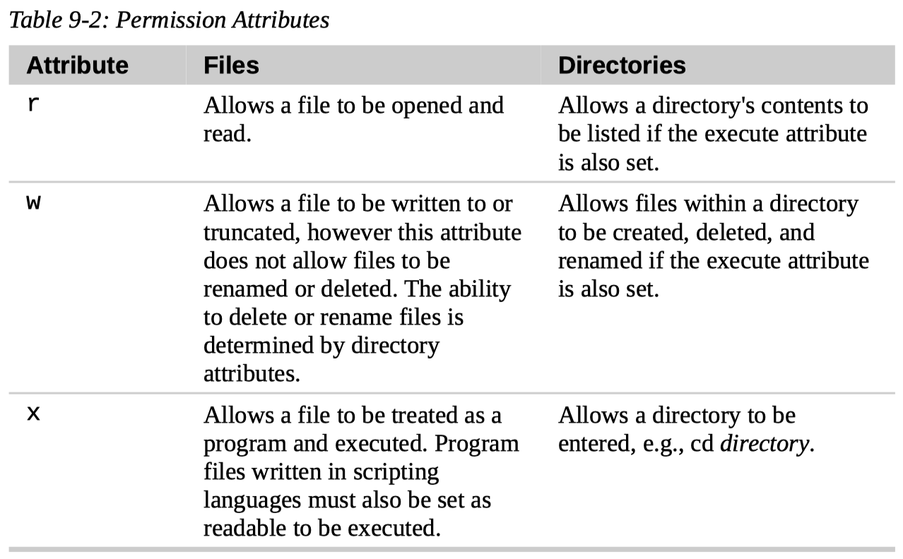

# 9. Permissions

## Owners, Group Members, and Everybody Else

- Owner

  In the Unix security model, a user may **own** files and directories.

  When a user owns a file or directory, the user has control over its access.

- Group

  Users can, in turn, belong to a group consisting of one or more users who are given access to files and directories by their owners.

- World

  In addition to granting access to a group, an owner may also grant some set of access rights to everybody, which in Unix terms is referred to as the **world**.

### Our Identities

- Find out our identities

  To find out information about your identity, use the `id` command.

  ``` console
  $ id
  uid=1000(juhan) gid=1000(juhan) groups=1000(juhan),4(adm),24(cdrom),27(sudo),30(dip),46(plugdev),120(lpadmin),131(lxd),132(sambashare)
  ```

- uid and gid

  When user accounts are created, users are assigned a number called a **user ID (uid)** which is then, for the sake of the humans, mapped to a username.

  The user is assigned a **primary group ID (gid)** and may belong to **additional groups**.

- Where does this info come from

  User accounts are defined in the `/etc/passwd` file and groups are defined in the `/etc/group` file.

  When user accounts and groups are created, these files are modified along with `/etc/shadow` which holds information about the user's password.

  For each user account, the `/etc/passwd` file defines the user (login) name, uid, gid, account's real name, home directory, and login shell.

  If we examine the contents of `/etc/passwd` and `/etc/group`, we notice that besides the regular user accounts, there are accounts for the superuser (uid 0) and various other system users.

- Primary group of a user

  While many Unix-like systems assign regular users to a common group such as “users”, modern Linux practice is to create a unique, single-member group with the same name as the user.

  This makes certain types of permission assignment easier.

## Reading, Writing, and Executing

- Access rights

  Access rights to files and directories are defined in terms of read access, write access, and execution access.

- Symbolic link

  Notice that with symbolic links, the remaining file attributes are always “rwxrwxrwx” and are dummy values.

  The real file attributes are those of the file the symbolic link points to.

- File attributes: 10 characters

  - File type: 1 character

  - File mode: 9 character

    - Read, write, and execute permissions for file's owner
    - Read, write, and execute permissions for file's group owner
    - Read, write, and execute permissions for everybody else

- Effect of rwx on files and directories

  

### `chmod`

To change the mode (permissions) of a file or directory, the `chmod` command is used.

- Who can change file mode

  Be aware that only the file’s owner or the superuser can change the mode of a file or directory.

- Two ways

  `chmod` supports two distinct ways of specifying mode changes: octal number representation, or symbolic representation.

- Octal number representation

  With octal notation, we use octal numbers to set the pattern of desired permissions.

  Since each digit in an octal number represents three binary digits, this maps nicely to the scheme used to store the file mode.

  - Octal, Binary, File Mode
  - 0, 000, ---
  - 1, 001, --x
  - 2, 010, -w-
  - 3, 011, -wx
  - 4, 100, r--
  - 5, 101, r-x
  - 6, 110, rw-
  - 7, 111, rwx

  By using three octal digits, we can set the file mode for the owner, group owner, and world.

  `chmod 600 foo.txt`

  By passing the argument “600”, we were able to set the permissions of the owner to read and write while removing all permissions from the group owner and world.

  Though remembering the octal to binary mapping may seem inconvenient, we will usually have only to use a few common ones: 7 (rwx), 6 (rw-), 5 (r-x), 4 (r--), and 0 (---).

- Symbolic representation

  `chmod` also supports a symbolic notation for specifying file modes.

  Symbolic notation is divided into three parts.

  - Who the change will affect
  - Which operation will be performed
  - What permission will be set.

  ---

  To specify who is affected, a combination of the characters “u”, “g”, “o”, and “a” is used as shown in Table 9-5.

  - Symbol, Meaning
  - u, Short for “user” but means the file or directory owner
  - g, Group owner
  - o, Short for “others” but means world
  - a, Short for “all.” This is the combination of “u”, “g”, and “o”

  If no character is specified, “all” will be assumed.

  ---

  The operation may be a “+” indicating that a permission is to be added, a “-” indicating that a permission is to be taken away, or a “=” indicating that only the specified permissions are to be applied and that all others are to be removed.

  ---

  Permissions are specified with the “r”, “w”, and “x” characters.

  ---

  Multiple specifications may be separated by commas.

- `--recursive` option

  A word of caution regarding the “--recursive” option: it acts on both files and directories, so it's not as useful as we would hope since we rarely want files and directories to have the same permissions.

### `umask`

The `umask` command controls the default permissions given to a file when it is created.

It uses octal notation to express a **mask** of bits to be removed from a file's mode attributes.

Everywhere a 1 appears in the binary value of the mask, an attribute is unset.

- `$ umask`

  Next, we ran the `umask` command without an argument to see the current value.

  It responded with the value `0002` (the value `0022` is another common default value), which is the octal representation of our mask.

- `$ umask 0000`

- When to change the mask

  Most of the time we won't have to change the mask; the default provided by the distribution will be fine.

  In some high-security situations, however, we will want to control it.

- Permenent umask change

  The necessary setting only lasts until the end of session and must be reset.

  In Chapter 11, we'll look at making the change to `umask` permanent.

### Special Permissions ???

In addition to read, write, and execute permission, there are some other, less used, permission settings.

- Setuid bit

  The first of these is the **setuid bit** (octal 4000).

  When applied to an **executable** file, it sets the effective user ID from that of the real user (the user actually running the program) to that of the program's owner.

  Most often this is given to a few programs owned by the superuser.

  When an ordinary user runs a program that is “setuid root” , the program runs with the effective privileges of the superuser.

  This allows the program to access files and directories that an ordinary user would normally be prohibited from accessing.

  Clearly, because this raises security concerns, the number of setuid programs must be held to an absolute minimum.

- Setgid bit

  The second less-used setting is the **setgid bit** (octal 2000), which, like the setuid bit, changes the effective group ID from the real group ID of the real user to that of the file owner.

  If the setgid bit is set on a **directory**, newly created files in the directory will be given the **group ownership of the directory** rather the group ownership of the file's creator.

  This is useful in a shared directory when members of a common group need access to all the files in the directory, regardless of the file owner's primary group.

- Sticky bit

  The third is called the **sticky bit** (octal 1000).

  This is a holdover from ancient Unix, where it was possible to mark an executable file as “not swappable.”

  On files, Linux ignores the sticky bit, but if applied to a **directory**, it prevents users from deleting or renaming files unless the user is either the owner of the directory, the owner of the file, or the superuser.

  This is often used to control access to a shared directory, such as `/tmp`.

## Changing Identities

There are three ways to take on an alternate identity.

1.  Log out and log back in as the alternate user.
2.  Use the `su` command.
3.  Use the `sudo` command.

From within our own shell session, the `su` command allows us to assume the identity of another user and either start a new shell session with that user's ID, or to issue a single command as that user.

The `sudo` command allows an administrator to set up a configuration file called `/etc/sudoers` and define specific commands that particular users are permitted to execute under an assumed identity.

The choice of which command to use is largely determined by which Linux distribution you use. Your distribution probably includes both commands, but its configuration will favor either one or the other.

### `su`

The `su` command is used to start a shell as another user.

`su [-[l]] [user]`

If the “-l” option is included, the resulting shell session is a **login shell** for the specified user.

This means the user's environment is loaded and the working directory is changed to the user's home directory. This is usually what we want.

If the user is not specified, the superuser is assumed.

Notice that (strangely) the `-l` may be abbreviated as `-`, which is how it is most often used.

- `$ su -`

  To start a shell for the superuser, we would do this.

- `$ su -c 'ls -l /root/*'`

  It is also possible to execute a single command rather than starting a new interactive command by using `su` this way.

  Using this form, a single command line is passed to the new shell for execution.

  It is important to enclose the command in quotes, as we do not want expansion to occur in our shell, but rather in the new shell.

### `sudo`

The administrator can configure `sudo` to allow an ordinary user to execute commands as a different user (usually the superuser) in a controlled way.

- Restricted number of commands

  In particular, a user may be restricted to one or more specific commands and no others.

- Don't need superuser's password

  Another important difference is that the use of `sudo` does not require access to the superuser's password.

  To authenticating using `sudo`, requires the user’s own password.

- `sudo` does not start a new shell

  One important difference between `su` and `sudo` is that `sudo` does not start a new shell, nor does it load another user's environment.

  This means that commands do **not** need to be **quoted** any differently than they would be without using `sudo`.

  Note that this behavior can be overridden by specifying various options.

- Start an interactive shell with `$ sudo -i`

  Note, too, that `sudo` can be used to start an interactive superuser session (much like `su -`) by using the `-i` option. See the sudo man page for details.

- `$ sudo -l`

  To see what privileges are granted by `sudo`, use the `-l` option to list them.

- Several minute of not having to enter password

  Notice that after the first use of `sudo`, `janet` was not prompted for her password. This is because `sudo`, in most configurations, “trusts” us for several minutes until its timer runs out.

### `chown`

The `chown` command is used to change the owner and group owner of a file or directory.

Superuser privileges are required to use this command.

The syntax of `chown` looks like this:

`chown [owner][:[group]] file...`

`chown` can change the file owner and/or the file group owner depending on the first argument of the command.

### `chgrp`

In older versions of Unix, the `chown` command only changed file ownership, not group ownership.

For that purpose, a separate command, `chgrp` was used. It works much the same way as `chown`, except for being more limited.

## Changing Your Password

- `$ passwd`

  To change your password, just enter the `passwd` command.

  You will be prompted for your old password and your new password.

- Set password for another user

  If you have superuser privileges, you can specify a username as an argument to the `passwd` command to set the password for another user.

- Other options

  Other options are available to the superuser to allow account locking, password expiration, and so on.

## Summary

- Identities in Unix

  - User

  - Group

    - Primary group or login group
    - Supplementary group

- File permission

  A file has permissions for its owner, its group owner, and world (others).

  When we create a file, its owner is the user identity we're using, its group owner is the primary group of the user. The default permission is 0777 for directories, 0666 for files. We also have to take umask into account.

  We can change these permissons. We can also change a file's owner, group owner.

- Special permission

  - setuid bit
  - setgid bit
  - sticky bit

- Decide if we have permisson or not

  We always do things to file or directory with some commands.

  These commands first find out your identity, then they use your identity to check with the file's permisson to see if you're permitted to do the operation.

